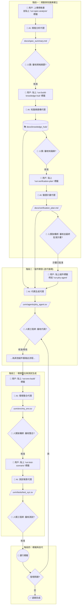

# csi2_ai_vip
AI-assisted MIPI CSI2 v4.0 UVM VIP development

```mermaid
flowchart TD
    subgraph "階段一：規劃與知識庫建立"
        A[👤 用戶: 上傳規格書<br>並貼上 'run:spec-analysis' 標籤] --> B(🤖 AI: 規格分析代理);
        B --> C[/docs/spec_summary.md/];
        C --> D{🧐 人類: 審核規格摘要?};
        D -- 核准 --> E[👤 用戶: 貼上 'run:build-knowledge-hub' 標籤];
        E --> F(🤖 AI: 知識庫建構代理);
        F --> G[(📚 docs/knowledge_hub/)]
        G --> H{🧐 人類: 審核知識庫?};
        H -- 核准 --> I[👤 用戶: 貼上 'run:verification-plan' 標籤];
        I --> J(🤖 AI: 驗證計畫代理);
        J --> K[/docs/verification_plan.md/];
        K --> L{👑 人類架構師: 審核並最終批准計畫?};
    end

    subgraph "階段二：組件開發 (迭代循環)"
        L -- 計畫已批准 --> M[👤 用戶: 貼上組件標籤<br>例如 'run:phy-agent'];
        
        %% 顯示代理使用知識庫和計畫
        G --> N;
        K --> N;

        M --> N(🤖 AI: 代碼生成代理);
        N --> O[/uvm/agents/phy_agent.sv/];
        O --> P{🧐 人類工程師: 審核代碼?};
        P -- 核准/修改 --> Q[...為其他組件重複此流程...];
    end

    subgraph "階段三：環境整合與測試生成"
        Q --> R[👤 用戶: 貼上 'run:env-build' 標籤];
        R --> S(🤖 AI: 環境整合代理);
        S --> T[/uvm/env/my_env.sv/];
        T --> U{🧐 人類架構師: 審核整合?};
        
        U -- 核准 --> V[👤 用戶: 貼上 'run:test-scenario' 標籤];
        V --> W(🤖 AI: 測試場景代理);
        W --> X[/uvm/tests/test_xyz.sv/];
        X --> Y{🧐 人類工程師: 審核測試?};
    end

    subgraph "階段四：模擬與迭代"
        Y -- 核准 --> Z((🚀 運行模擬));
        Z --> Z_Loop{發現問題?};
        Z_Loop -- 是 --> P;
        Z_Loop -- 否 --> End([✅ 週期完成]);
    end
```